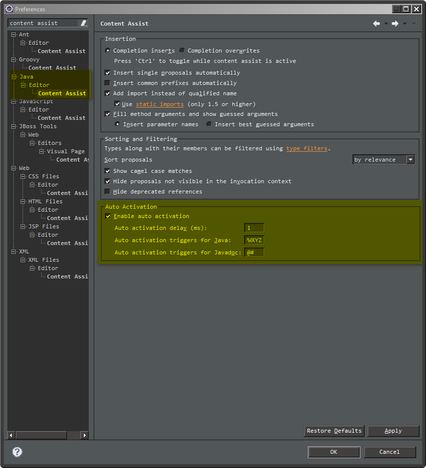
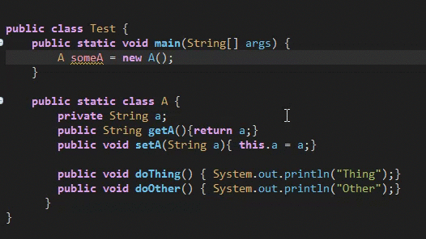
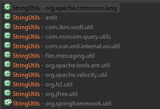
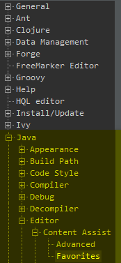
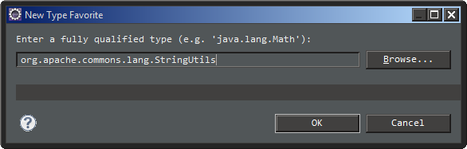
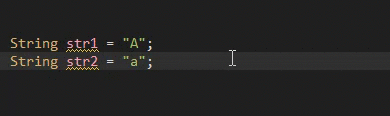
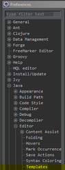
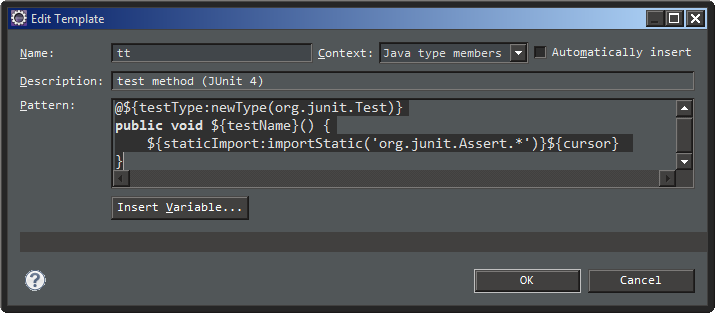

# Eclipse-Tricks

Tips and Tricks for making Eclipse more Productive

## Content Assist

By default, content assist is set to trigger on '.'. So if you have a basic class:
```java
public class A {
  private String a;
  public String getA(){return a;}
  public void setA(String a){ this.a = a;}
  
  public void doThing() { System.out.println("Thing");}
  public void doOther() { System.out.println("Other");}
}
```

Then you have an instance of that class elsewhere:
```java
A someA = new A();
```

If you type the following, you should get some content assist for the relevant methods:
```java
someA.
```


This is cool - but wouldn't it be *better* if we could get content assist that felt more... intelligent? Well, the great news is that we can!
Under Windows --> Preferences --> Java --> Editor --> Content Assist



They key parts are:

*Auto activation delay* and *Auto activiation triggers for Java*.

Changing the delay to 1 ms and the triggers to '.abcdefghijklmnopqrstuvwxyzABCDEFGHIJKLMNOPQRSTUVWXYZ' results in some really cool features.

If I now have:
```java
so
```

Content assist will offer some sugestions - like someA. If it's the only suggestion, typing "." will auto-complete the variable for us - neat!

This now enables us to have some really cool camel-case completion of methods as well. Typing:

```java
someA.dT
```

The suggestion doThing will automatically appear. Typing ';' will then autocomplete that line. Awesome.



## Favourites

Normally, you'd be working away, and need to do something like, compare Strings, ignoring case, such as:

```java
String str1 = "A";
String str2 = "a";
StringUtils.equalsIgnoreCase(str1, str2);
```

Simple enough - but what if you'd forgotten the name of the library with the equalsIgnoreCase method? Or worse yet, what if there were multple StringUtils....



Favourites are a nifty feature which make it easier to use your favourite libraries, like StringUtils. It can be found under: Window --> Preferences --> Java --> Editor --> Content Assist --> Favourites



From the side, you can add your own Types to the list, by clicking **New Type...**. In this example, we'll add the ever favourite StringUtils.



With this in the list, the next time you need to equalsIgnoreCase, you can simply begin typing, and it will be presented as an option. When you select it, it will be added as a static import if it's not already present. Awesome!



## Templates

Templates provide a quick and powerful way to get rid of a lot of the annoying boilerplate that you need to write. One of the most basic examples, is when you need to write a basic test stub.

```java
import org.junit.Test;
// Heap of stuff..
@Test
public void testName() {

}
```

What a pain! Fortunately, we can get around at least part of the pain, and reduce hte number of keypresses to around 2.

Let's create a template. Open up Window --> Preferences --> Java -> Editor --> Templates



We'll create a new template to stub this out for us.
```java
@${testType:newType(org.junit.Test)}
public void ${testName}() {
	${staticImport:importStatic('org.junit.Assert.*')}${cursor} 
}
```

Now, when we add this template with the name "tt", like:



We'll get a nice autocomplete for the Test:


